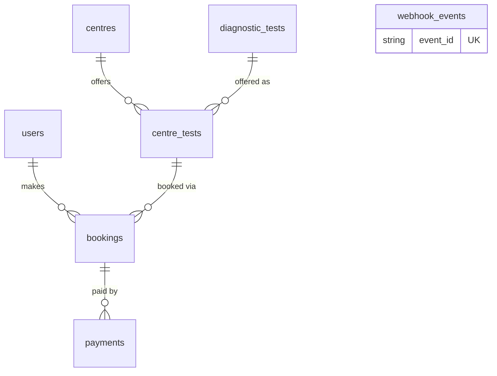

# EVE Diagnostics Booking API

Backend service for booking diagnostic tests at diagnostic centres, with a simulated payment
provider and an idempotent payment webhook. Built with FastAPI, PostgreSQL and SQLAlchemy 2.0.

## Run it

### Option A: Docker

```bash
git clone https://github.com/Flankerflyer30mki/eve-healthcare && cd eve-diagnostics-backend
cp .env.example .env          # then put real random values in JWT_SECRET and WEBHOOK_SECRET
docker compose up --build
docker compose exec api python -m app.seed     # sample centres and tests
```

API: http://localhost:8000 — Swagger UI: http://localhost:8000/docs

### Option B: local Python (Postgres in Docker)

```bash
cp .env.example .env
docker compose up -d db
python -m venv .venv && source .venv/bin/activate    # Windows: .venv\Scripts\Activate.ps1
pip install -r requirements.txt
python -m app.seed
uvicorn app.main:app --reload
```

Generate secrets with: `python -c "import secrets; print(secrets.token_hex(32))"`

### Tests

```bash
python -m pytest -v                            # local
docker compose run --rm api python -m pytest   # in Docker
```

Tests use an in-memory SQLite database (forced in `tests/conftest.py`), so they never touch real data.

### Project layout

```
app/
  main.py            app setup and routers
  config.py          settings from environment / .env
  database.py        engine, session, get_db
  models.py          SQLAlchemy models
  schemas.py         request/response models
  security.py        password hashing, JWT
  deps.py            get_current_user dependency
  seed.py            sample data
  routers/           auth, centres, diagnostic_tests, bookings, payments
scripts/send_webhook.py   signs and sends a webhook event for manual testing
tests/                    pytest suite
```

## API

| Method | Path | Auth | Purpose |
|---|---|---|---|
| POST | `/auth/signup` | – | Create account |
| POST | `/auth/login` | – | Get JWT |
| GET | `/auth/me` | JWT | Current user |
| GET | `/centres?location=&limit=&offset=` | – | List centres with their tests and prices |
| GET | `/centres/{id}` | – | One centre |
| POST | `/centres` | JWT | Create centre |
| POST | `/centres/{id}/tests` | JWT | Offer a test at a centre with a price |
| GET / POST | `/tests` | – / JWT | List / create tests |
| POST | `/bookings` | JWT | Create a PENDING booking |
| GET | `/bookings?status=&limit=&offset=` | JWT | List my bookings |
| GET | `/bookings/{id}` | JWT | One of my bookings |
| POST | `/bookings/{id}/cancel` | JWT | Cancel (PENDING or CONFIRMED only) |
| POST | `/payments/` | JWT | Simulated payment for a PENDING booking |
| POST | `/payments/webhook/` | HMAC signature | Payment status event from the provider |
| GET | `/health` | – | Liveness check |

### Example requests

```bash
# sign up and log in
curl -X POST localhost:8000/auth/signup -H "Content-Type: application/json" \
  -d '{"email":"a@test.com","full_name":"A","password":"password123"}'
TOKEN=$(curl -s -X POST localhost:8000/auth/login -H "Content-Type: application/json" \
  -d '{"email":"a@test.com","password":"password123"}' | python -c "import sys,json; print(json.load(sys.stdin)['access_token'])")

# book a test (centre 1, test 1)
curl -X POST localhost:8000/bookings -H "Authorization: Bearer $TOKEN" -H "Content-Type: application/json" \
  -d '{"centre_id":1,"test_id":1,"appointment_at":"2030-01-01T10:00:00Z"}'

# pay (optional "outcome" forces SUCCESS or FAILED; omit for a random 80% success)
curl -X POST localhost:8000/payments/ -H "Authorization: Bearer $TOKEN" -H "Content-Type: application/json" \
  -d '{"booking_id":1,"outcome":"SUCCESS"}'
```

### Webhook

The provider signs the **raw request body** with HMAC-SHA256 using `WEBHOOK_SECRET` and sends the hex digest in `X-Signature`.

```bash
BODY='{"event_id":"evt_1","booking_id":1,"provider_ref":"prov_1","status":"SUCCESS"}'
SIG=$(printf '%s' "$BODY" | openssl dgst -sha256 -hmac "$WEBHOOK_SECRET" | awk '{print $NF}')
curl -X POST localhost:8000/payments/webhook/ -H "X-Signature: $SIG" -H "Content-Type: application/json" -d "$BODY"
```

Or use the helper: `python -m scripts.send_webhook <booking_id> <SUCCESS|FAILED> <event_id> <provider_ref>`

Responses: `{"result":"processed"}`, `{"result":"duplicate"}` (event already seen), `{"result":"ignored"}` (payment already recorded).

## How the webhook stays idempotent

1. `webhook_events.event_id` is UNIQUE. The event is inserted first; a replay violates the constraint and returns `duplicate` without touching anything.
2. `payments.provider_ref` is UNIQUE. A new event for an already-recorded payment creates no second payment.
3. A booking only leaves `PENDING`. A late or conflicting event can never flip `CONFIRMED` to `FAILED` or revive a `CANCELLED` booking.
4. The booking row is locked (`SELECT ... FOR UPDATE`) while a payment, webhook or cancel runs, so concurrent requests on the same booking run one at a time.
5. Requests without a valid signature get 401 before anything is read or written.

## Database schema



| Table | Key columns |
|---|---|
| `users` | email (unique), password_hash (bcrypt) |
| `centres` | name, location |
| `diagnostic_tests` | name (unique) |
| `centre_tests` | centre_id, test_id, price. UNIQUE (centre_id, test_id) |
| `bookings` | user_id, centre_test_id, appointment_at, amount, status |
| `payments` | booking_id, amount, status, provider_ref (unique) |
| `webhook_events` | event_id (unique), payload (JSON) |

Design notes:

- A booking references `centre_tests` rather than separate test and centre ids, so the database itself guarantees the centre offers that test.
- `bookings.amount` is a **price snapshot**: later price changes don't rewrite history.
- Money is `NUMERIC(10,2)` and serialized as strings, never floats.
- Booking states: `PENDING`, `CONFIRMED`, `FAILED`, `CANCELLED`.

## Assumptions

- Any logged-in user can create centres, tests and offerings; there is no admin role.
- `POST /payments/` settles immediately (the mock provider). 80% succeed unless `outcome` is given.
- A failed payment makes the booking `FAILED` permanently; the user books again. Retrying payments would mean leaving the booking `PENDING` on failure.
- Cancelling a `CONFIRMED` booking does not simulate a refund.
- Other users' bookings return 404, not 403, so ids don't leak.
- `appointment_at` must be timezone-aware and in the future. There is no slot capacity or overlap check.
- JWTs last 60 minutes; there are no refresh tokens.
- Tables are created at startup with `create_all`; there are no migrations.

## What I would improve with more time

- Alembic migrations instead of `create_all`.
- Run the tests against real PostgreSQL in CI. SQLite ignores `FOR UPDATE`, so the row locking is not exercised by the current suite.
- Admin role for managing centres; rate limiting on login and signup.
- Process webhooks asynchronously (Celery) with retries, and an outbox for reliable delivery.
- Slot capacity, rescheduling, and refunds on cancellation.
- Structured JSON logging with request ids; Redis caching for the centre list.